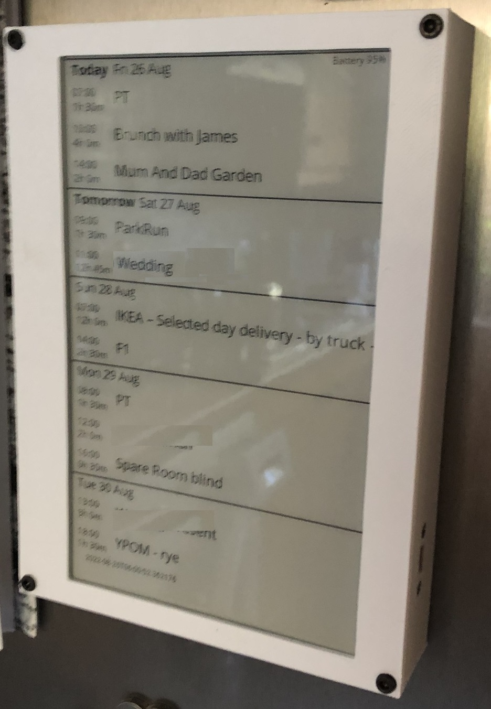
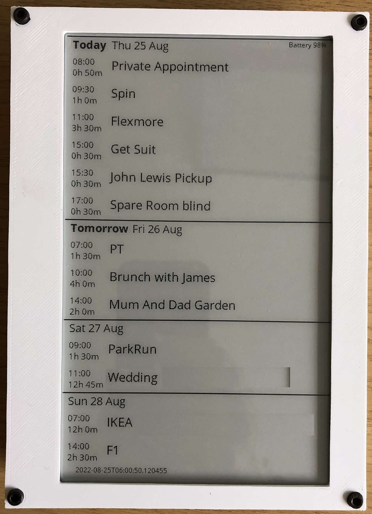
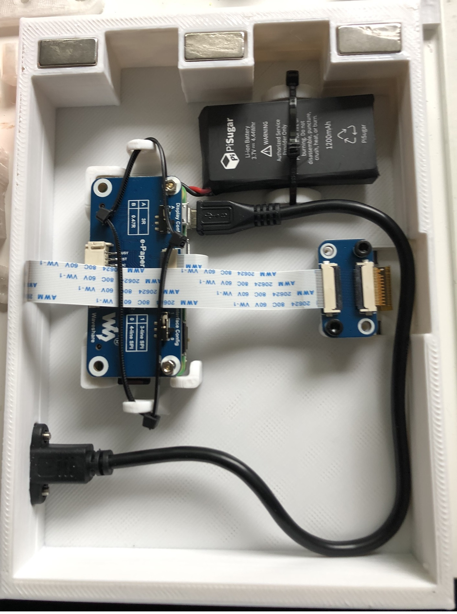
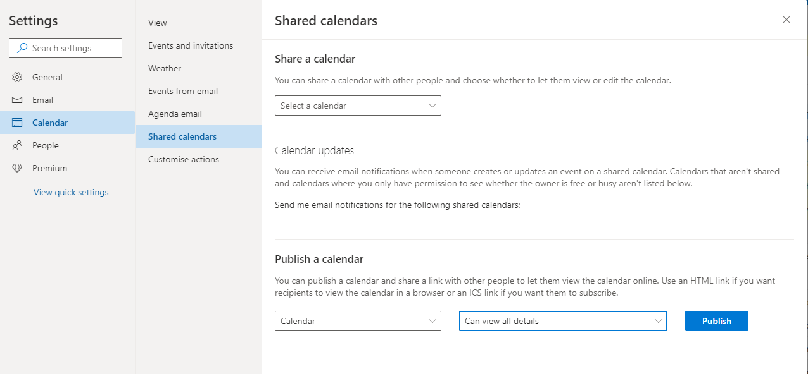
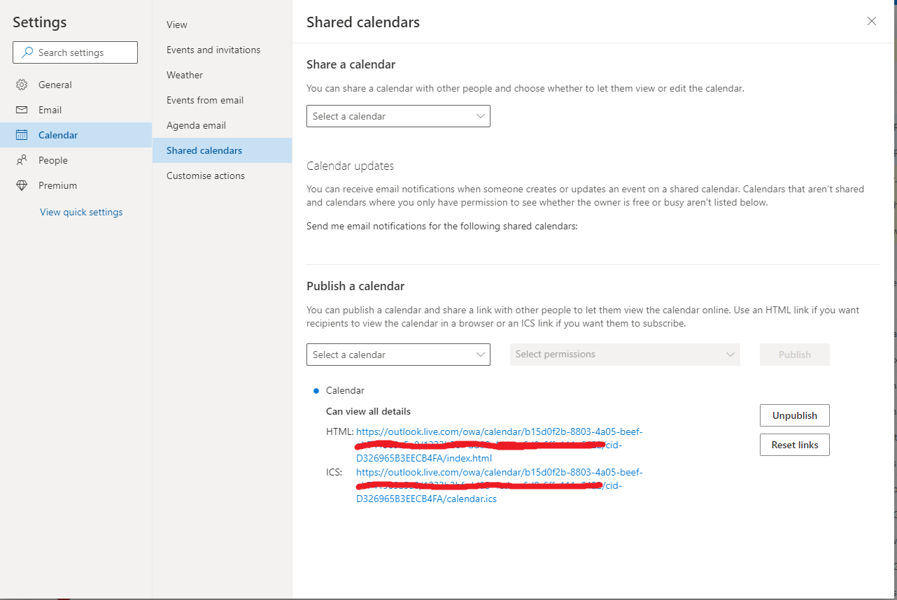

# e-inkCalendar

This repo contains the code needed to drive a 7.5" e-ink display and act as a calendar. This project uses a battery powered (PiSugar2) Raspberry Pi Zero 2 WH (or install your own headers). Calendar events are retrived from Micrsoft Outlook.com.
The layout is based off how the iOS Outlook client shows calendar information. This felt like the best use for the 480x800 space available in the e-ink display.

This project was inspired by [MagInkCal](https://github.com/speedyg0nz/MagInkCal/blob/main/README.md) and some of his code does appear in this project. That project uses a much bigger e-ink display and they are a lot more expensive than the display I have used here.

I created this project as a way to learn python and github while building something usful. The device is magentically attached to my kitchen fridge. Updates as 6am every morning to show me todays planned events along with as many future events that can fit on the page.
Battery percentage is shown in the top right so you know when to recharge and a timestamp of the last sucessful screen update is shown in the bottom left on the screen.








## Hardware Required
- [Raspberry Pi Zero 2 WH](https://www.raspberrypi.com/products/raspberry-pi-zero-2-w/) - Header pins are needed to connect to the E-Ink display. A Pi Zero 1 should also work
- [Waveshare 800×480 7.5inch E-Ink display HAT for Raspberry Pi](https://www.waveshare.com/7.5inch-e-paper-hat.htm) - Be careful as there is a version that also does red. While you will be able to make it work the driver code would need changing. Make sure you just buy the black and white display
- [PiSugar2 for Raspberry Pi Zero](https://www.pisugar.com/) ([Tindie](https://www.tindie.com/products/pisugar/pisugar2-battery-for-raspberry-pi-zero/)) - Provides the RTC and battery for this project

- [Magnets 20 x 10 x 2mm](https://www.amazon.co.uk/gp/product/B07VMMK12N) - Glued into the 3D printed case

- [25cm Micro USB USB 2.0 Male Connector to Micro USB 2.0 Female Extension Cable Pitch 17.5mm With screws Panel Mount Hole](https://www.aliexpress.com/item/1005002626850501.html) - Used to make charging easier.

- 6x M3x8 hex bolts to hold the 3D printed case together

- 3D printer - to print the case


## How It Works
Through PiSugar2's web interface, the onboard RTC can be set to wake and trigger the RPi to boot up daily at a time of your preference. Upon boot, a cronjob on the RPi is triggered to run a Python script that fetches calendar events from Microsoft Calendar for the next few days, and formats them into the desired layout before displaying it on the E-Ink display. The RPi then shuts down to conserve battery. The calendar remains displayed on the E-Ink screen, because well, E-Ink...

Features of the calendar: 
- Battery life needs more testing but should last a couple of weeks. The Rpi zero 2 may be more power hungry than the Rpi zero. Retriving the calendar information takes the most amount of time. Maybe this can be optimised. I also have to force a wait command in the CronJob to make sure the system connects to the wifi
- Displays Day and date then lists start time and duration of events
- The calendar always starts from today and fills with as many events that will fit.
- Battery level is displayed in top right corner
- Timestamp of when the last update occured printed on the bottom left of screen

## Bugs / improvement idea's

- Not sure how the system handles events spanning multiple days
- Currently only works against outlook.com calendars
- Would like to add a button to force a refresh

## Share your outlook Calendar

1. Login to [Outlook](www.outlook.com)
2. Top right corner press the Cog (settings)
3. Select the "View all outlook settings" link
* Select Calendar and then Shared calendars
* Under "Publish a calendar" select your calendar and "Can view all details" option
* click the "Publish" link


* You will then see an ICS link be generated


**Make a note of the ICS link. You will need it later**


## Setting Up Raspberry Pi Zero
1. Start by flashing [Raspberrypi OS Lite](https://www.raspberrypi.org/software/operating-systems/) to a MicroSD Card. I recommend using the Raspberry Pi Imager. You can then pre-configure Wifi and other information. A great timesaver

2. Install the [PiSugar](https://github.com/PiSugar/PiSugar/wiki/PiSugar2) following their guide
* Configure the Pi to startup at 6am everyday.

3. Install the eInk libries. [Guide here](https://www.waveshare.com/wiki/7.5inch_e-Paper_HAT_Manual#Users_Guides_of_Raspberry_Pi)

* Install BCM2835 libraries
```bash
#Open the Raspberry Pi terminal and run the following command
wget http://www.airspayce.com/mikem/bcm2835/bcm2835-1.71.tar.gz
tar zxvf bcm2835-1.71.tar.gz
cd bcm2835-1.71/
sudo ./configure && sudo make && sudo make check && sudo make install
# For more information, please refer to the official website: http://www.airspayce.com/mikem/bcm2835/
```
* Install WiringPi libraries:

```bash
#Open the Raspberry Pi terminal and run the following command
sudo apt-get install wiringpi
#For Raspberry Pi systems after May 2019 (earlier than before, you may not need to execute), you may need to upgrade:
wget https://project-downloads.drogon.net/wiringpi-latest.deb
sudo dpkg -i wiringpi-latest.deb
gpio -v
# Run gpio -v and version 2.52 will appear. If it does not appear, the installation is wrong
#Bullseye branch system use the following command:
git clone https://github.com/WiringPi/WiringPi
cd WiringPi
./build
gpio -v
# Run gpio -v and version 2.60 will appear. If it does not appear, it means that there is an installation error
```

* Install Python

```bash
sudo apt-get update
sudo apt-get install python3-pip
sudo apt-get install python3-pil
sudo apt-get install python3-numpy
sudo pip3 install RPi.GPIO
sudo pip3 install spidev
```

4. Copy e-inkCalendar folder over to the Pi. I use WinSCP for this task and the folder ends up in /home/pi/e-inkCalendar You can put the code where ever you like but further commands may need to be updated.

5. Install required packages.

Navigate to the e-inkCalendar and run the following

```bash
pip install -r requirements.txt
```

This should install all the required packages

6. Open the config.json file in the e-inkCalendar folder and update the icsURL link with the link you created earlier


7. Run the following command in the RPi Terminal to open crontab.
```bash
sudo crontab -e
```
 Specifically, add the following command to crontab so that the Python script runs each time the RPi is booted up.
```bash
@reboot sleep 20; cd /home/pi/e-inkCalendar && sudo python3 main.py &
```

## Config file
Should look like

```json
{
    "icsURL": "",    
    "dayToCapture": 8,
    "shutdownOnUpdate":true
}
```